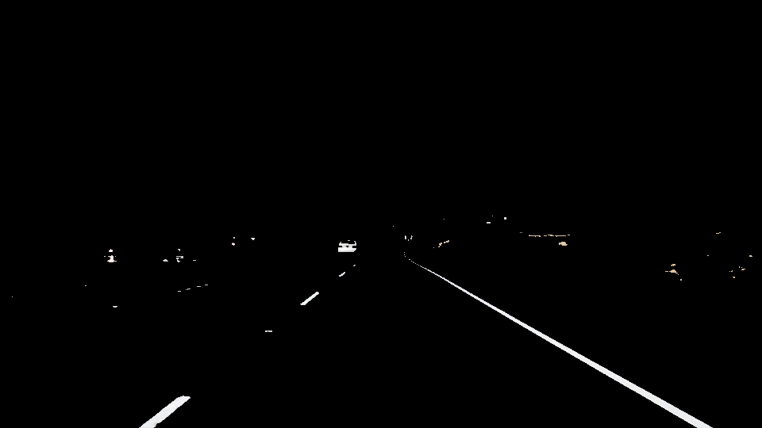
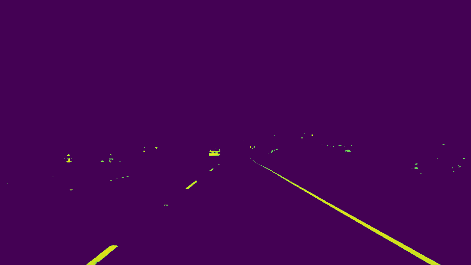
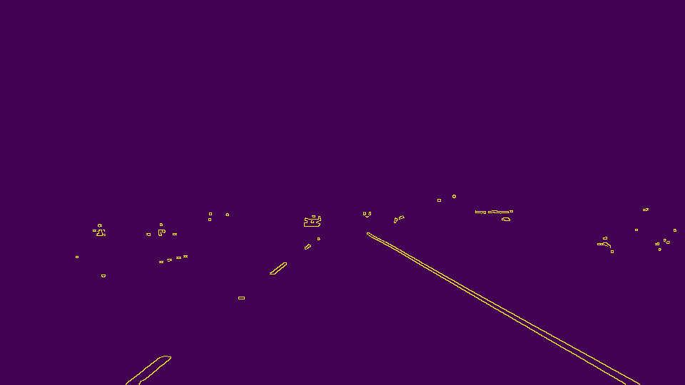
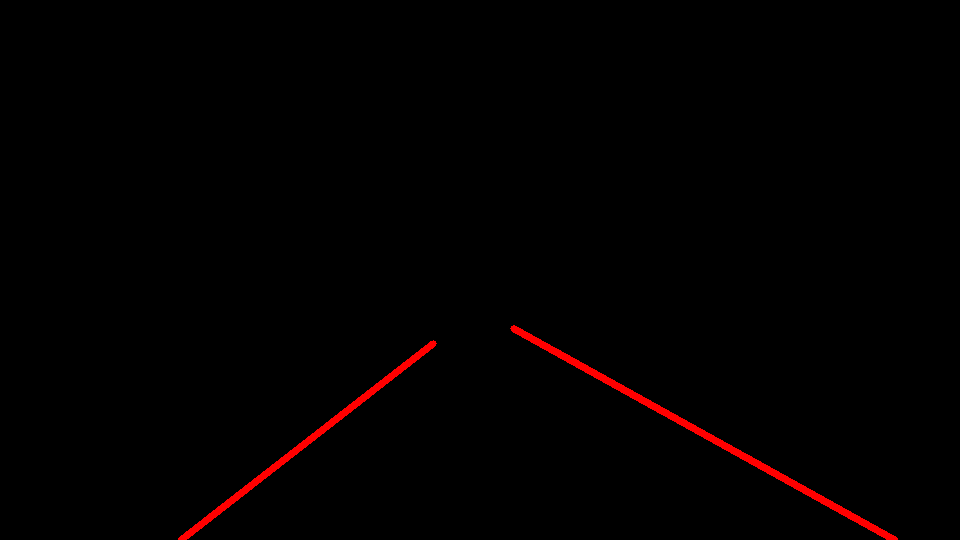
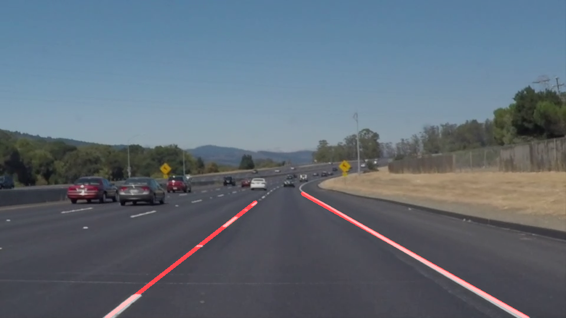

# **Finding Lane Lines on the Road** 

---

**Finding Lane Lines on the Road**

The goal of this project is to mark lanes on the video.

---

### Reflection

### 1. Pipeline

1. Color treshold

2.Grayscale

3. Gaussian blur

4. Canny Edge Detection

5. Apply clipping mask

6. Hough Lines

7. Combining initial image and lines into one, final image

### 2. Identify potential shortcomings with your current pipeline

One potential shortcoming with my approach might be lanes on a curvy road.

The code might not work very well when image is too bright or too dark, because I've used hard-coded value for color treshold.

### 3. Suggest possible improvements to your pipeline

A possible improvement would be to use dinamically adjust color treshold depending on the brightness of the image.

Another potential improvement could be to better adjust clipping mask or use few different ones and then try to pick one that is best fit for current situation on the road.
